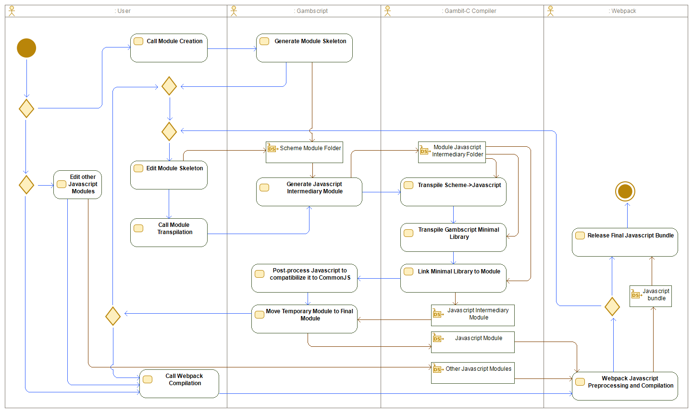
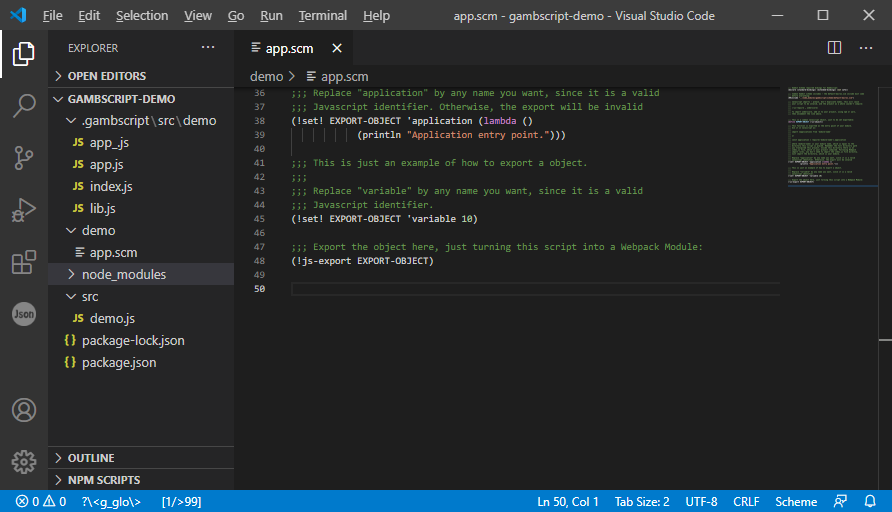
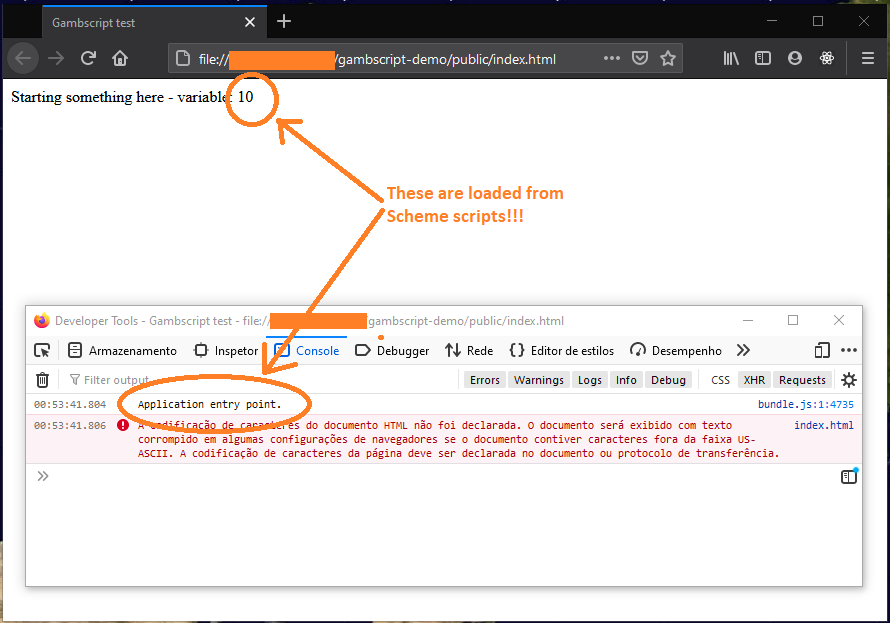
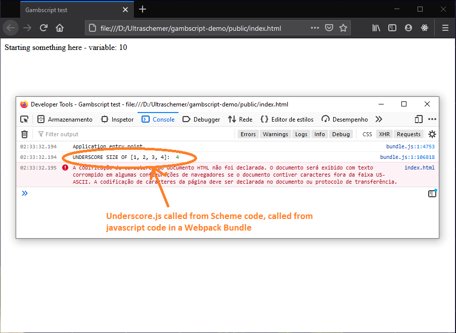

# Gambit Scheme Scripts Called under Javascript/Webpack Control

## Introduction

Gambscript is a utility to create **Gambit Scheme** Javascript Modules, from scheme source code. The first two sections of this document are conceptual. If you aren't interested in how Gambscript works internally, you can skip them, and go to the third section, **Tutorial**.

## 1. Motivation and Rationale

[**Gambit scheme**](https://github.com/gambit/gambit) has a fairly complete Scheme->Javascript transpiler, suitable to implement full programs and applications on [Node.js](https://nodejs.org) platform, from Scheme scripts.

An example of a node project developed using Gambit Scheme is presented in [this project](https://github.com/ultraschemer/gambit-node-script-template).

But, if you build the node application, using the default Gambit Scheme configurations and tools, you will end-up with an executable script with more than 30 MB of size. Furthermore, Gambit Scheme toolchain add some shell scripts (Batch scripts, in the case of Windows) to help the program being loaded and run suitably.

This is not a suitable approach to develop Javascript Applications to be run in the browser.

To permit full-featured scheme scripts to be run in the browser, the author of this project choose an approach to solve the next problems:

1. The generated Javascript application/module must be as lightweight as possible, permitting easy loading of scheme generated code in web-applications and pages.
2. Scheme projects must be compatible, in module level, with Modern Javascript, using Node.js CommonJS or ES6 Module system.
3. Scheme projects for web must be compatible with [**Webpack**](https://webpack.js.org/), the most used packing tool for Web Javascript Applications, even being used outside web (in Electron and React Native projects)
4. A fairly minimal standard library, only enabling integration of basic Scheme Code with existent Javascript libraries (via Webpack), needs to be provided, to ensure the entire toolchain is lightweight.
5. Any specific Scheme feature won't be packaged (CLOS libraries, SRFIs, etc) in favor of libraries already developed by the Javascript community, and available to be used from Webpack, using [**npm**](https://www.npmjs.com/) and [**yarn**](https://yarnpkg.com/).

Considering these five points, **the objective of Gambscript is to develop a Webpack/Node.js compatible dialect of R5RS Scheme, leveraging the existent Javascript libraries available to developers, through Webpack and Npm**.

The first version of this project (v0.1.0) has been able to reach this objective, and this is the **sole** objective of this project. No utilities library, nor extra tools will be provided by this project, for the sake of its sharp focused approach.

The default Gambscript library will be focused on in facilities to permit integration of Javascript language and Webpack with Gambit Scheme projects. The provided facilities in the default library will exist only to serve this purpose.

## 2. How Gambscript Works

Gambscript is a simple command line tool that load a specific scheme script, which is the endpoint of the Scheme Module, and transpile it to Javascript, using Gambit Scheme.

Gambscript is concerned with the loading os Scheme scripts, its dependencies, then their transpilation to a valid Javascript code, packing all Scheme logic into a self-contained Javascript CommonJS module (in the future, this CommonJS module can be an ES6 module, but, currently, compatibility to CommonJS is enough).

This self-contained Javascript CommonJS module can be attached to an existent Webpack project, and it can be used as any Javascript Module in a Webpack project. Since this module is CommonJS, it's compatible with NodeJS projects without any change, and even without Webpack. But it's a colateral effect of Gambscript architecture, not a planned feature. It must be reiterated that Gambscript modules are to be used with Webpack, as its main purpose.

After the javascript module is generated, the Webpack toolchain takes over the code, and Webpack can link the module to other Javascript modules and even process the generated Javascript code, minifying it and obfuscating it if necessary.

**The current Gambscript generated modules are CommonJS, not ES6, so any technology which process ES6 javascript files (like React.js JSX preprocessor) won't work on Gambscript generated code. This is considered a Bug, to be solved in future releases.**

Javascript code generated by Gambit-C compiler is valid Javascript but it's not Webpack valid Javascript. Webpack enforces some good coding behavior from the developers, and Gambit-C generated code just not follows these enforcements. Fortunately, this is easily solvable preprocessing the output of Gambit-C, adjusting the generated code to the code expected by Webpack.

Considering what has been told before, the expected workflow with Gambscript follows, in the next picture:



Each of the steps of the Activity Diagram above is explained below, to give a full understanding about how Gambscript works:

1. **Start:** The user start the project. At this point it's assumed Node.js, Webpack and Gambit-C Scheme, with Javascript Backend enabled, are installed and working on command line **PATH**.
2. **Call Module Creation:** User call the Gambscript command, to create a new module. See this command in the Gambscript tutorial, below.
3. **Generate Module Skeleton:** At this moment, Gambscript will create a folder to contain the Scheme Module. This folder can be considered a full Scheme project, independent of any other projects. It's under the user responsibility to structure this project, to import Scheme libraries, to define its architecture, since it respect its given endpoint (a script called _app.scm_). These projects only support Gambit-Scheme **##include** commands, no permitting the use of Scheme module system, since the module system championed by Gambscript is the Webpack ES6/CommonJS one. Anyway, respecting the entry point, the user is free to define which architecture he/she wants to his project. This task will create a new folder, in the path given by the user, with the module name.
4. **Edit Module Skeleton:** At this point, the user can edit your own rules, and algorithms, on his/her Scheme module. The module can even have more than one Scheme file, if they're properly included in the _app.scm_ file. The utilities from Gambscript default library can be used to integrate scheme code to Javascript. See the tutorial section for more details.
5. **Call Module Transpilation:** After the user implement his/her logic into the generated Scheme module, he/she calls Gambscript again, now giving the module to be transpiled, and the module output place. Gambscript will start the transpilation process, and the outputs are an intermediary module folder, with transpiled intermediary code. Gambscript will use this intermediary module folder to store intermediary javascript code generated from Scheme, and to link properly these generated intermediary code generated files.
6. **Transpile Scheme->Javascript:** This task is performed by Gambit-C compiler, with `-target js` switch enabled. It's necessary to say that a proper installation of Gambit-C compiler, with Javascript Backend enabled, is necessary at this point. Gambscript assumes it's installed in the system, and this step will fail if the Gambit scheme compiler is not provided suitably.
7. **Transpile Gambscript Minimal Library:** At this moment, Gambscript ask Gambit-C to compile the default Gambscript library.
8. **Link Minimal Library to Module:** Gambscript minimal library must be linked to the module, so the Javascript integration library Gambscript provides can be used. After this step, a version of the full module library, converted to Javascript exists. This is already valid Javascript, but it yet is not compabible to CommonJS nor with Webpack.
9. **Post-process Javascript to compatibilize it to CommonJS:** This step is performed by Gambscript script. It loads the Javascript library generated previously and process it, adjusting the deviations from Standard Strict Javascript Webpack requires. Variables assigned but not declared are properly declared, function declaration is converted to the canonical form and the `require` commands in the script are placed in the proper location, at this step. After this postprocessing this post-processed Javascript file is saved in the location chosen by the user for the generated Javascript module.
10. **Move Temporary Module to Final Module:** The temporary module, post-processed to support CommonJS and Webpack properly is moved to its final place, to be used by the other Webpack modules or as the main project code.

These first then steps can be proceeded in cycles, as the user improves his/her Scheme code. In parallel, he/she can implement Javascript or Typescript modules that will use this Scheme module. It's possible, too, to write an almost pure Scheme project using Gambscript, but in this way, the entire features of Gambscript won't be leveraged.

After the user developed his/her scheme code, he/she can use Webpack normally, to create the application final bundle, as say the next described tasks:

11. **Edit other Javascript Modules:** At this point, the user can use the Scheme generated Javascript module as any Javascript module created to be used by Webpack. The Scheme Module can be imported by other modules, in any Webpack compatible language. The Scheme Javascript module can appear huge (more than 300KB), but after proper Webpack processing, it will shrink to 150Kb, on average.
12. **Call Webpack Compilation:** The user can call Webpack toolchain, now, to create a final bundle to his/her project. All Javascript modules can be used as Webpack input. The Webpack configuration and use is normal, and transparent. Only ES6 depending processing are not available to Scheme modules, at this moment, but it doesn't reduce the genericity of the Javascript module generated by Gambscript and Gambit-C. To call Webpack properly is under the user responsibility,and Gambscript tasks, at this point, can be considered finished.
13. **Webpack Javascript Preprocessing and Compilation:** Once Webpack is called, it can perform its transpilation and processing tasks, normaly, generating the project bundle, as expected.
14. **Release Final Javascript Bundle:** After the entire project is built, the user can choose to release the final bundle to public in the way he/she wishes.

The code of Gambscript, at _"node_modules/gambscript/bin/gambscript.js"_ is implemented with comments to reflect the compilation steps required to generate compatible CommonJS and Webpack Javascript modules from Scheme source code.

## 3. Tutorial

Here we present a tutorial on how to use Gambscript.

### 3.1. Pre-requisites

To use Gambscript you need a proper installation of **Node.js**, **NPM** or **Yarn**, and **Gambit-C Scheme compiler, with Javascript Backend enabled**. The installation of these dependencies are beyond the scope of this document. Gambscript has been tested on Windows 10, 64Bit, and Linux Ubuntu 18.04. Testing on Mac OS X will be provided in future releases.

### 3.2. Installing Gambscript

The best way to install Gambscript is per project, not in the Global environment. To do so, just start a new Npm (or Yarn) project:

```sh
$ mkdir gambscript-demo
$ cd gambscript-demo
$ npm init
```

Answer the `npm init` questions with the best answers to you.

After creating the project, let's install gambscript locally. Currently, no public NPM package exists to Gambscript. So we need to install it directly from the git repository:

```sh
$ npm install --save-dev ultraschemer/gambscript#v0.1.0
```

After installing Gambscript, it's possible to run it using the **npx** facility:

```sh
$ npx gambscript
Module name is missing.

Usage:
        [npx ]gambscript create <module-name>
        [npx ]gambscript transpile <module-name> [<output-directory>]

The default <output-directory> value is "./src"
```

As you can see, if you run gambscript without any parameter, a little explanation about how to use it is show in the standard output.

Let's create a first simple module:

```sh
$ npx gambscript create demo

$ cd demo
$ ls
app.scm

```

As you can see, a folder called `demo`, with a single Scheme script, called `app.scm`, is created. You can consider this folder as an entire Scheme project. This Scheme project must have its entrypoint registered in the `app.scm` file, and it can include other scheme files, using the Gambit Scheme **##include** facility. Apart this, the structure of your Scheme project is completely under the responsibility of the user.

We can build a javascript module from the `demo` Scheme module using the next command:

```sh
$ cd .. # return to the project root directory
$ npx gambscript transpile demo
Building the application...
gsc -prelude "(define-cond-expand-feature|enable-type-checking|)(define-cond-expand-feature|disable-auto-forcing|)(define-cond-expand-feature| disable-sharp-dot|)(define-cond-expand-feature| disable-bignum|)(define-cond-expand-feature| disable-ratnum|)(define-cond-expand-feature| disable-cpxnum|)(define-cond-expand-feature|disable-smp|)" -target js  -o D:\Ultraschemer\gambscript-demo\.gambscript\src\demo\app.js -c demo\app.scm


Building the default library...
gsc -prelude "(define-cond-expand-feature|enable-type-checking|)(define-cond-expand-feature|disable-auto-forcing|)(define-cond-expand-feature| disable-sharp-dot|)(define-cond-expand-feature| disable-bignum|)(define-cond-expand-feature| disable-ratnum|)(define-cond-expand-feature| disable-cpxnum|)(define-cond-expand-feature|disable-smp|)" -target js  -o D:\Ultraschemer\gambscript-demo\.gambscript\src\demo\lib.js -c D:\Ultraschemer\gambscript-demo\node_modules\gambscript\scheme\lib.scm


Linking the application...
gsc -prelude "(define-cond-expand-feature|enable-type-checking|)(define-cond-expand-feature|disable-auto-forcing|)(define-cond-expand-feature| disable-sharp-dot|)(define-cond-expand-feature| disable-bignum|)(define-cond-expand-feature| disable-ratnum|)(define-cond-expand-feature| disable-cpxnum|)(define-cond-expand-feature|disable-smp|)" -target js  -link -l lib app.js


Finished building scheme Module.

Finished releasing new generated module: D:\Ultraschemer\gambscript-demo\src\demo.js

$
```

The parameter given to `transpile` Gambscript option must be the same given to the `create` option, called before. Gambscript `transpile` receives as a parameter a folder containing an `app.scm` file, as its entry point.

After building the module, it's possible to see that it's output to the file `<project-root>/src/demo.js`. By default, all Gambscript modules are exported to a `<project-root>/src` folder. The user can override this option, just adding an additional parameter to the `transpile` command. This last option will be the output directory to generate the Javascript module. The Javascript module name is always the name of the original module directory (created by `gambscript create`, followed by `.js`).

So, now, you'll have a valid CommonJS `demo` module, which can be imported by Node.js, and your project structure will be equals that shown in the image below (using the VSCode editor):



You can test the generated `demo` module, as shown in the code below:

```sh
$ # You must be at the project root directory
$ node
> require("./src/demo")
{ application: [Function: procedure], variable: 10 }
> const d = require("./src/demo")
undefined
> d.variable
10
> d.application()
Application entry point.
undefined
> .exit

$
```

### 3.3. Enabling Webpack to use Gambscript Scheme Modules

The main objective of Gambscript is to be compatible with Webpack and then enable the development of full-fledged professional Web applications using Scheme. So, the next part of this tutorial is to create a suitable Webpack configuration for this project, and load the generated Scheme Module in a Web application.

Let's start installing Webpack dependencies:

```sh
$ # You must be at the project root directory
$ npm install --save-dev @babel/core
$ npm install --save-dev @babel/preset-env
$ npm install --save-dev babel-loader
$ npm install --save-dev css-loader
$ npm install --save-dev source-map-loader@^1.1.0
$ npm install --save-dev style-loader
$ npm install --save-dev webpack
$ npm install --save-dev webpack-cli
$ npm install --save-dev webpack-node-externals
```

The packages selected above are fairly suitable to the vast majority of Webpack compatible projects. Obviously, you can use any configuration and packages to your project, but the selection above just works, if you don't want to be concerned with the exact selection of dependencies you need to run a Webpack enabled Gambscript project (and, unfortunately, dependency hell is a sad reality in Webpack/Node.js projects).

Now let's install some Javascript nodule to be used by the bundled project, to be released to the Web application and runnable in the browser:

```sh
$ # You must be at the project root directory
$ npm install --save underscore
```

We need, now, suitable configuration files to [Babel](https://babeljs.io/) and Webpack. (Obs.: It's possible to create _jsconfig.json_ and _tsconfig.json_ files to compatibilize the project to Javascript and Typescript custom modules too, but these are outside the scope of this document. See the demo project available [here](https://github.com/ultraschemer/gambscript-template-test), as a sample.).

Create, in the root directory, the _webpack.config.js_ file, containing:

```Javascript
const path = require('path')

module.exports = (env) => {
  return {
    entry: './src/index.js',
    module: {
      rules: [
        {
          test: /\.js$/,
          exclude: /node_modules|server/,
          use: {
            loader: 'babel-loader',
          },
        },
        {
          enforce: 'pre',
          test: /\.js$/,
          loader: 'source-map-loader',
        },
        {
          test: /\.css$/i,
          use: ['style-loader', 'css-loader'],
        },
      ],
    },
    output: {
      filename: 'public/javascript/bundle.js',
      path: path.resolve(__dirname),
    },
    resolve: {
      modules: ['node_modules', 'src'],
    },
    optimization: {
      minimize: true,
      mergeDuplicateChunks: false,
    },
    devtool: env.production ? false : 'inline-source-map'
  }

```

And save the project.

As you can see, it's necessary to create an _src/index.js_ file, which is the entry point of the entire Webpack project, and a _public_ folder, with the HTML which will receive the Webpack bundle.

Create the _src/index.js_ file, and put the next listing as its contents:

```Javascript
import { application, variable } from './demo'

document.write('Starting something here - variable: ', variable)
application()
```

As you can see, the _index.js_ code is compatible with ES6. Outside the Gambscript generated module (_src/demo.js_) you can use ES6 Javascript code normally - just enable CommonJS handling in Webpack (currently setted as default - no need of extra Babel configuration files).

Then, create a _public_ folder, and add in it an _index.html_ as shown below:

```html
<!DOCTYPE html>
<html>
  <head>
    <meta name="viewport" content="width=device-width, initial-scale=1.0" />
    <title>Gambscript test</title>
  </head>
  <body>
    <script src="javascript/bundle.js"></script>
  </body>
</html>
```

The HTML file above import the script file _javascript/bundle.js_. This file will be generated by webpack.

Now we can build the Javascript bundle, from Webpack, importing the Javascript module generated from Scheme, by Gambscript:

```sh
$ # You must be at the project root directory
$ npx webpack
asset public/javascript/bundle.js 893 KiB [compared for emit] [minimized] [big] (name: main)
runtime modules 878 bytes 4 modules
cacheable modules 368 KiB
  ./src/index.js 128 bytes [built] [code generated]
  ./src/demo.js 368 KiB [built] [code generated]

WARNING in asset size limit: The following asset(s) exceed the recommended size limit (244 KiB).
This can impact web performance.
Assets:
  public/javascript/bundle.js (893 KiB)

WARNING in entrypoint size limit: The following entrypoint(s) combined asset size exceeds the recommended limit (244 KiB). This can impact web performance.
Entrypoints:
  main (893 KiB)
      public/javascript/bundle.js


WARNING in webpack performance recommendations:
You can limit the size of your bundles by using import() or require.ensure to lazy load some parts of your application.
For more info visit https://webpack.js.org/guides/code-splitting/

webpack 5.11.1 compiled with 3 warnings in 3714 ms
```

Now you have a complete Webpack project, consuming a Scheme module from Gambscript. Just open the _public/index.html_ file on your browser and you'll see the project running:



The development mode of Webpack packs maploader data, which turns the generated Bundle.js file very big. To shrink the _bundle.js_ file to more palatable sizes, just run Webpack in production mode:

```sh
$ # You must be at the project root directory
$ npx webpack --env production
asset public/javascript/bundle.js 105 KiB [compared for emit] [minimized] (name: main)
runtime modules 878 bytes 4 modules
cacheable modules 368 KiB
  ./src/index.js 128 bytes [built] [code generated]
  ./src/demo.js 368 KiB [built] [code generated]
webpack 5.11.1 compiled successfully in 2487 ms
```

### 3.4. Developing Gambscript Scheme Scripts

Now we installed Gambscript and enabled it to be used with Webpack modules, we need to learn how to implement code and logic in Scheme and use them in Webpack modules.

If you open the _demo/app.scm_, you'll see it is full of comments, explaining the structure of the module entrypoint format. Just open it and read to understand the module format.

After understanding the _demo/app.scm_ structure, you can remove all comments. The file will be very clean, simple, as is show below:

```Scheme
(declare (standard-bindings) (extended-bindings) (not safe))
(##include "../node_modules/gambscript/scheme/default-macros.scm")

(define EXPORT-OBJECT (!js-object))
(!set! EXPORT-OBJECT 'application (lambda ()
				    (println "Application entry point.")))
(!set! EXPORT-OBJECT 'variable 10)
(!js-export EXPORT-OBJECT)
```

You can import a library using the `!js-require` facility, provided by Gambscript. Always use `!js-require` after the main module includes, as show below. A snippet of code in the `'application` exported function show how to use the new imported library.

```Scheme
(declare (standard-bindings) (extended-bindings) (not safe))
(##include "../node_modules/gambscript/scheme/default-macros.scm")

;;; Modules import - always after the default-macros library include:
(!js-require _ underscore)

(define EXPORT-OBJECT (!js-object))
(!set! EXPORT-OBJECT 'application (lambda ()
            (println "Application entry point.")
            ;; Calling underscore.js _.size method here:
            (!sa console.log "UNDERSCORE SIZE OF [1, 2, 3, 4]: " (!xa _.size (!xa Array 1 2 3 4)))))

(!set! EXPORT-OBJECT 'variable 10)
(!js-export EXPORT-OBJECT)
```

As you can see, two more Gambscript facilities are called: `!sa`, which means "statement-apply" and `!xa`, which means "expression-apply". All Gambscript Javascript->Scheme integration functions, macros and facilities start with an **exclamation point** (!).

Now, build the new module, call Webpack to generate the bundle, and load it in the browser, again:

```sh
$ # You must be at the project root directory
$ npx gambscript transpile demo
...
...
$ npx webpack --env production
...
...
$
```

And the result is show in the picture below:



An more complete example, demonstrating various ways to integrate Javascript and Scheme is show in the [Demo Template Project](https://github.com/ultraschemer/gambscript-template-test). The major difference between the Demo Template project is the project created in this tutorial is the use of Webpack 4 (when this example has been developed, Webpack 5 was available and it is used here). Consult and study the Demo Template Project to understand what Gambscript is capable of do.

The next section documents the Gambscript library.

## 3.5. The Gambscript default library

Gambscript default library is very simple and it's concerned **only** with Javascript code and module integration.

The provided facilities are macros (available in the default-macros.scm file, which need be imported - always) and in the default library (which doesn't need to be imported, it's available by default to all Gambscript scripts):

1. **!s** **(Macro):** Signature: **(!s . params)**. Shortcut to `##inline-host-statement`, permit to run Javascript statements embedded into Scheme code. **params**: list which the first parameter must be a string literal, with Javascript code to be executed, and the other elements are variables to be passed to Javascript, from Scheme.
2. **!e** **(Macro):** <span style="color: red">TBD</span>
3. **!x** **(Macro):** <span style="color: red">TBD</span>
4. **!sa** **(Macro):** <span style="color: red">TBD</span>
5. **!ea** **(Macro):** <span style="color: red">TBD</span>
6. **!xa** **(Macro):** <span style="color: red">TBD</span>
7. **!js-require** **(Macro):** <span style="color: red">TBD</span>
8. **!js-expression-call** **(Macro):** <span style="color: red">TBD</span>
9. **!js-e-call** **(Macro):** <span style="color: red">TBD</span>
10. **!js-call** **(Macro):** <span style="color: red">TBD</span>
11. **!call** **(Macro):** <span style="color: red">TBD</span>
12. **!!** **(Macro):** <span style="color: red">TBD</span>
13. **!js-expression-raw-call** **(Macro):** <span style="color: red">TBD</span>
14. **!js-e-rcall** **(Macro):** <span style="color: red">TBD</span>
15. **!js-x-rcall** **(Macro):** <span style="color: red">TBD</span>
16. **!js-rcall** **(Macro):** <span style="color: red">TBD</span>
17. **!rcall** **(Macro):** <span style="color: red">TBD</span>
18. **!!r** **(Macro):** <span style="color: red">TBD</span>
19. **!js-statement-call** **(Macro):** <span style="color: red">TBD</span>
20. **!js-s-call** **(Macro):** <span style="color: red">TBD</span>
21. **!s-call** **(Macro):** <span style="color: red">TBD</span>
22. **!scall** **(Macro):** <span style="color: red">TBD</span>
23. **!!!** **(Macro):** <span style="color: red">TBD</span>
24. **!js-global** **(Procedure):** <span style="color: red">TBD</span>
25. **!raw-js-global** **(Procedure):** <span style="color: red">TBD</span>
26. **!js-export** **(Procedure):** <span style="color: red">TBD</span>
27. **!raw-js-export** **(Procedure):** <span style="color: red">TBD</span>
28. **!js-object** **(Function)** <span style="color: red">TBD</span>
29. **!js-object-set!** **(Procedure):** <span style="color: red">TBD</span>
30. **!js-obj-set!** **(Procedure):** <span style="color: red">TBD</span>
31. **!obj-set!** **(Procedure):** <span style="color: red">TBD</span>
32. **!set!** **(Procedure):** <span style="color: red">TBD</span>
33. **!js-object-raw-set!** **(Procedure):** <span style="color: red">TBD</span>
34. **!obj-raw-set!** **(Procedure):** <span style="color: red">TBD</span>
35. **!raw-set!** **(Procedure):** <span style="color: red">TBD</span>
36. **!js-object-get** **(Function):** <span style="color: red">TBD</span>
37. **!js-obj-get** **(Function):** <span style="color: red">TBD</span>
38. **!obj-get** **(Function):** <span style="color: red">TBD</span>
39. **!get** **(Function):** <span style="color: red">TBD</span>
40. **!js-object-raw-get** **(Function):** <span style="color: red">TBD</span>
41. **!js-obj-raw-get** **(Function):** <span style="color: red">TBD</span>
42. **!obj-raw-get** **(Function):** <span style="color: red">TBD</span>
43. **!raw-get** **(Function):** <span style="color: red">TBD</span>
